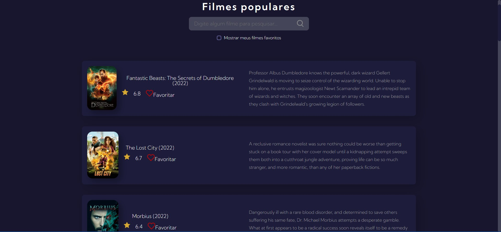
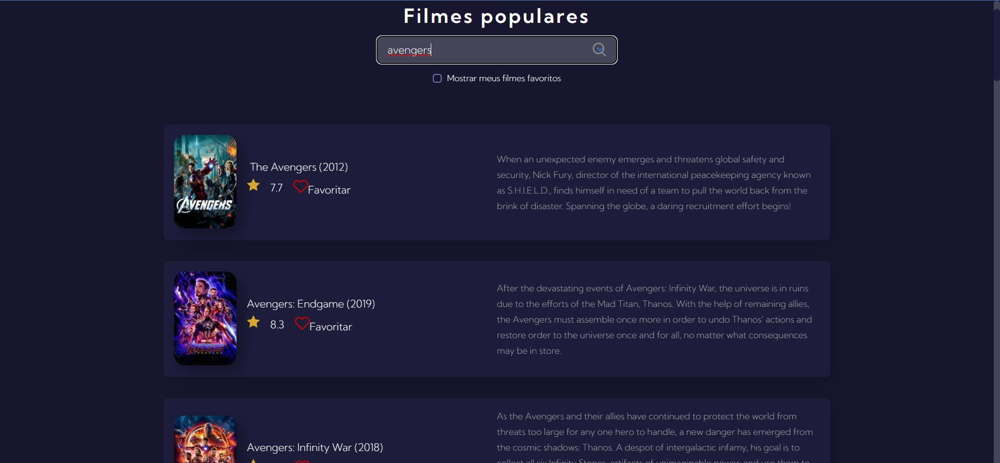
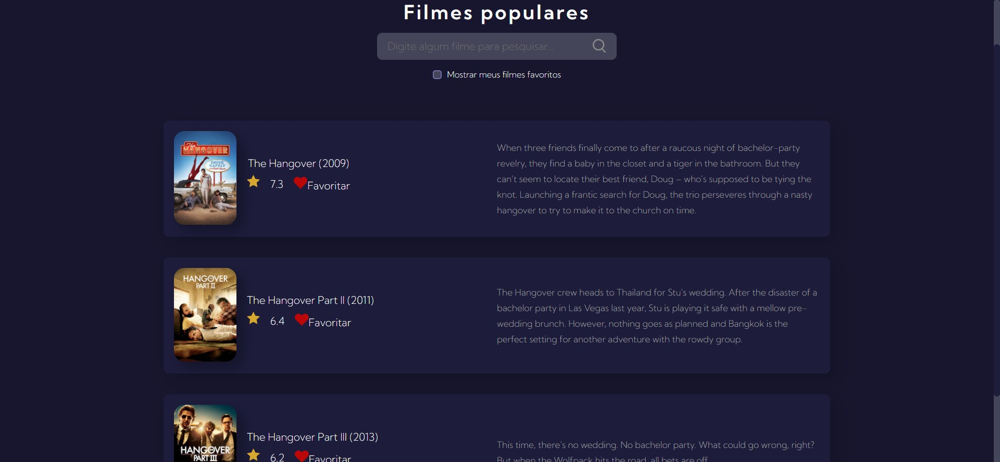

### **Filmes**

##

1. Objetivos do site  
Treinar requisição de api.

2. API KEY  

<ul>
    <li>2.1 API Key deve ser inserida a chave no arquivo apikey.js  </li>
    <li>2.2 Para gerar o arquivo apikey.js apenas copiar o arquivo exemplo apikey_example.js.</li>
    <li>2.3 Para você obter uma chave precisa acessar o [site](https://www.themoviedb.org/documentation/api) do <strong>The Movie Database</strong> e se cadastrar como web developer.
    <li>2.4 Não é possível alterar a api, apenas usá-la. </li>
 </li>
</ul>

3. Seção Inicial  

3.1 Pesquisar algum filme   

3.2 Pesquisar algum filme   

4. Tecnologia usadas:  

*  
*  
*  
*  